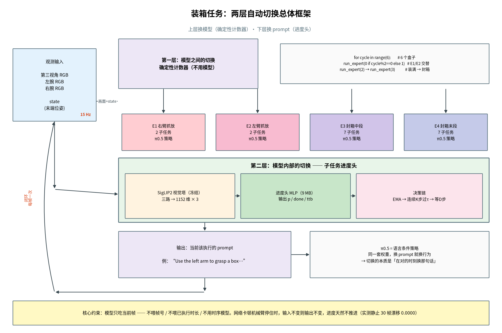
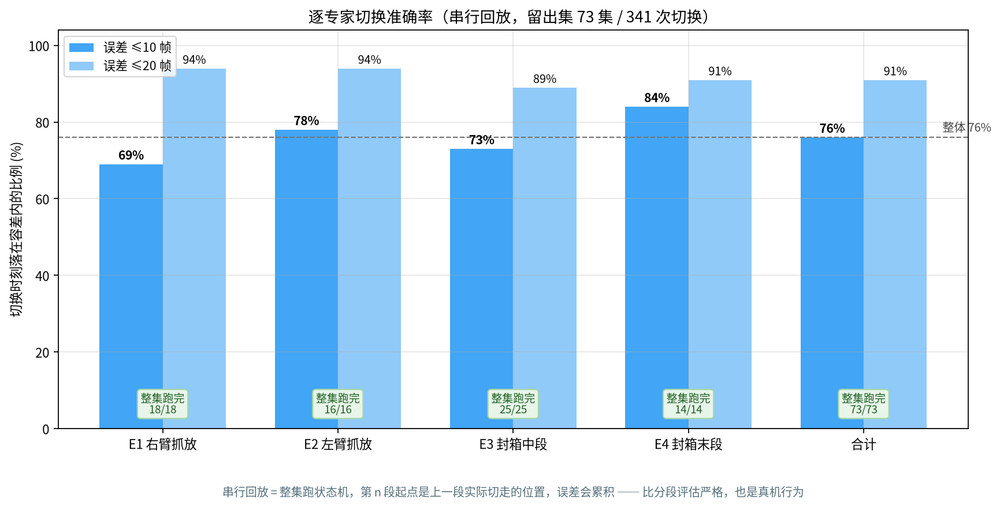
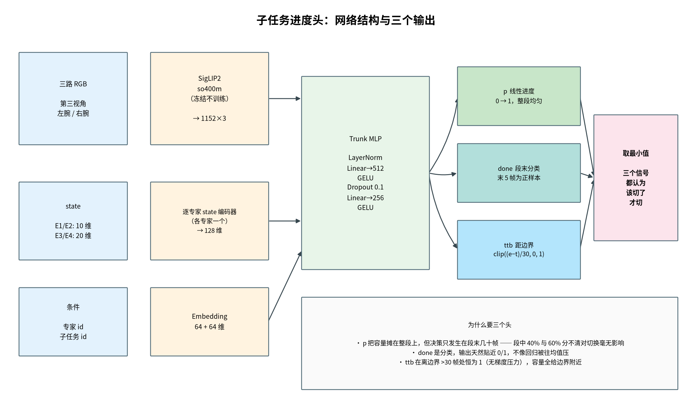
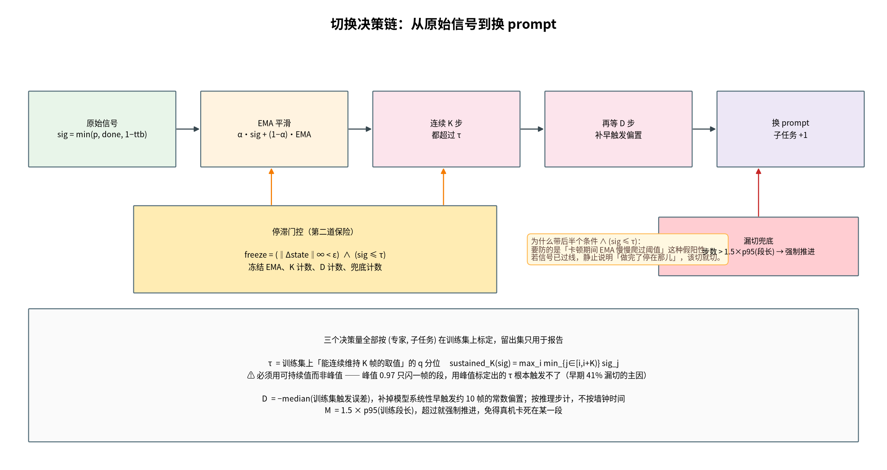
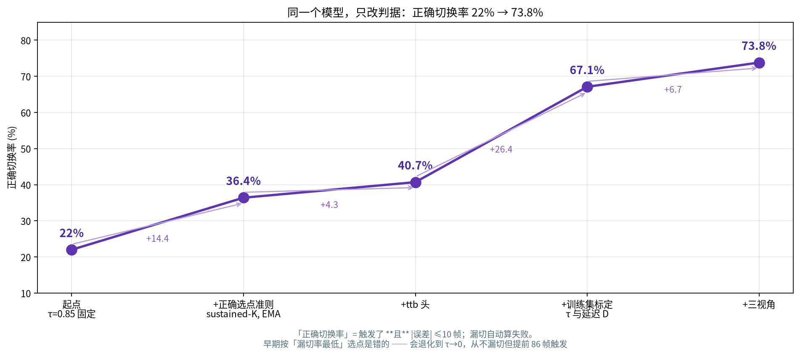
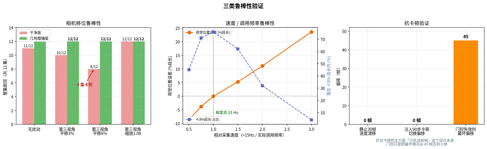
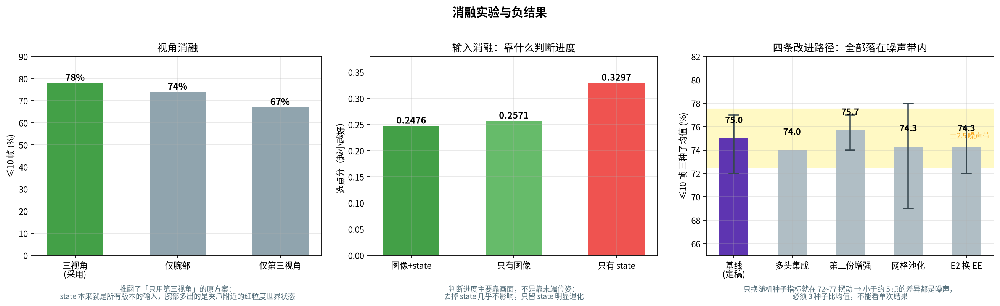
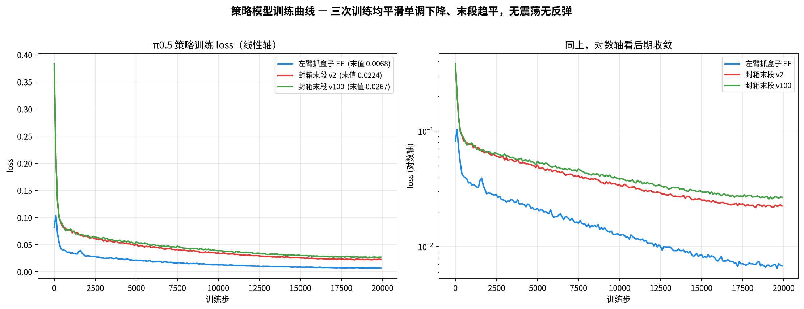

# 子任务进度头 — 长程 VLA 任务的自动阶段切换

让四个 π0.5 策略在一个 **18 子任务、约 4 分钟**的装箱任务中自动接力并自动切 prompt,
**全程无需人工按键**。

这是 [long-horizon-vla-manipulation](https://github.com/vfamatialas-ship-it/long-horizon-vla-manipulation)
里"自动切换"那一块的完整研究记录 —— 方法、标定、消融、鲁棒性测试,以及**几个负结果**。



---

## 问题

π0.5 是**语言条件**策略:同一套权重,喂"抓盒子"就去抓,喂"放进箱子"就去放。
所以长程任务的自动化要回答两个性质不同的问题:

| | 换什么 |
|---|---|
| **该由哪个模型接管** | 换推理服务(端口 / checkpoint) |
| **模型内部该做哪一步** | 模型不变,换喂给它的那句话 |

第二层的本质是 **"在正确的时刻换那句话"**。

### 一条贯穿全部设计的约束

部署时网络卡顿会让机械臂停在原地。所以模型**只吃当前帧** ——
不喂帧号、不喂已执行时长、不用任何时序模型。

> 卡住时输入不变 → 输出不变 → 进度天然不推进。

这条约束同时也**限死了精度天花板**,见 [§ 天花板](#天花板在哪)。

---

## 结果

| | |
|---|---|
| 留出集串行回放整集跑完 | **73/73 = 100%**(定稿版) |
| 切换时刻误差 ≤10 帧 / ≤20 帧 | **76% / 91%**(15fps,20 帧 = 1.33 秒) |
| 静止 30 帧的进度漂移 | **0.0000** |
| 注入 90 步卡顿后的切换偏移 | **0 帧** |
| 单步延迟 | **7 ms**(约 140Hz,15Hz 下占空比 10%) |
| 标注人力 | **0** —— 标签由 `prompt_index` 游程导出 |



**串行回放**口径:整集跑状态机,第 n 段的起点是上一段**实际**切走的位置,
误差会跨段累积 —— 比分段评估严格得多,也才是真机行为。

| 专家 | 整集跑完 | 切换数 | ≤10 帧 | ≤20 帧 |
|---|---|---|---|---|
| E0 右臂抓放 | 18/18 | 36 | 69% | 94% |
| E1 左臂抓放 | 16/16 | 32 | 78% | 94% |
| E2 封箱中段 | 25/25 | 175 | 73% | 89% |
| **E3 封箱末段** | 14/14 | 98 | **84%** | 91% |
| **合计** | **73/73** | 341 | **76%** | **91%** |

> **两个版本的权重,数字略有不同。** 上表是定稿版(E1 用 16 维关节角 state)。
> 实际部署的链路里 E1 换成了末端位姿版策略,所以按全 EE 重训了一版
> (`eeall_s2`,`state_dim = {0:10, 1:10, 2:20, 3:20}`),留出集为
> **70/73 = 96%**,≤10/≤20 帧同为 **76% / 91%**。
> 部署包里放的是后者。详见 [`docs/部署接入.md`](docs/部署接入.md)。
>
> 原来那份 16 维权重现在**已经无法评估** —— 特征缓存重建成 10 维后加载即报
> `expanded size (16) must match existing size (10)`。这是不可逆的,如实记录。

---

## 方法

### 1 · 标签:零人工

数据集的 `prompt_index` 逐帧记录,同一子任务是一段**连续游程**,游程起止即边界。
每段 `[s, e]`(`L = e − s`)导出三种标签:

```
p_t    = (t − s) / L                    线性进度
done_t = 1[ t ≥ e − 4 ]                 段末 5 帧软窗口
ttb_t  = clip((e − t) / 30, 0, 1)       距边界的归一距离
```

导出 **236,957 帧 / 1,583 段 / 369 集,顺序异常 0 集**,事件锚点数与段数完全对齐。

> ⚠ **标签用了时间,但模型输入里没有任何时间量。**
> 这是抗卡顿的根本,也是最容易被误读成"按采集时长切换"的地方。

### 2 · 特征:冻结的 SigLIP2

三路 RGB → SigLIP2-so400m(**冻结,不训练**)→ 1152 维 × 3。

视觉塔冻结,所以特征可以一次性缓存,之后训练是纯 MLP,**一轮几十秒**。

> ⚠ 解码必须用 **PyAV**:两路腕部相机是 AV1,`cv2` 会**静默**失败并产出全零特征。
> 这个坑不报错,只是指标莫名其妙上不去。

### 3 · 进度头:一个小 MLP,三个输出



图像特征 + state + (专家 id, 子任务 id) → `p` / `done` / `ttb`。

各专家的 state 语义不同(E0/E1 是 10 维单臂末端位姿,E2/E3 是 20 维双臂),
所以**每个专家配一个独立的 state 编码器**,不做 padding 混用。

**为什么要三个头**:

| 头 | 它擅长什么 |
|---|---|
| `p` 线性进度 | 容量摊在整段上 —— 但决策只发生在段末几十帧 |
| `done` 分类 | 输出天然贴 0/1 |
| `ttb` 距边界 | 离边界 >30 帧处恒为 1,容量全给边界附近 |

```
signal = min(p, σ(done), 1 − ttb)      三个信号都认为该切了才切
loss   = SmoothL1(p) + 1.0·BCE_w+(done) + 0.1·单调性 + 2.0·SmoothL1(ttb)
```

### 4 · 标定与决策链



全部按 **(专家, 子任务)** 分别标定,**只用训练集**,留出集仅用于报告。

```
τ_sub = Quantile_q( sustained_K(EMA(sig)) )
        其中 sustained_K(sig) = max_i min_{j∈[i,i+K)} sig_j
D_sub = −median(训练集触发误差)          补早触发偏置
M_sub = 1.5 × p95(训练段长)              漏切兜底
```

> ⚠ **τ 必须用"可持续 K 帧的值",不能用峰值。**
> 触发规则要求连续 K 帧过线;瞬时峰值 0.97 但只闪一帧的段,
> 用峰值标定出的 τ 根本触发不了 —— 这一条占了早期 **41% 漏切**的绝大部分。

部署时:

```
sig = min(p, σ(done), 1−ttb)
  → EMA_t = α·sig + (1−α)·EMA_{t−1}
  → 连续 K 步都 > τ
  → 再等 D 步(按推理步计, 非墙钟时间)
  → 换 prompt
```

**停滞门控**:`freeze = (‖Δstate‖∞ < ε) ∧ (sig ≤ τ)`,冻结 EMA 与全部计数器。

后半个条件是关键 —— 要防的是"卡顿期间 EMA 慢慢爬过阈值"这种假阳性;
若信号**已经**过线,静止说明"做完了停在那儿",该切就切。

### 5 · 第一层(专家之间)不用模型

6 个盒子是已知确定量,用**计数器 + 进度头的 `finished` 标志**即可。
数计数器比数模型准 —— 为什么不能用模型,见 [§ 负结果](#负结果二专家级图像分类器不可行)。

---

## 决策规则的修正历程



**同一个模型,只改判据**,22% → 73.8%:

| 阶段 | 正确切换率 |
|---|---|
| 起点(τ = 0.85 固定) | 22% |
| + 正确的选点准则(sustained-K 标定、EMA) | 36.4% |
| + `ttb` 头 | 40.7% |
| + 用训练集标定 τ 与延迟 D | 67.1% |
| + 三视角 | **73.8%** |

主指标定义为 **"触发了 且 |误差| ≤ 10 帧"**,漏切自动算失败。

> 早期按"漏切率最低"选点是**错的** —— 会一路退化到 τ→0:
> 从不漏切,但**提前 86 帧**触发。指标定义错了,优化得越好离目标越远。

---

## 鲁棒性



### 抗卡顿

| 测试 | 结果 |
|---|---|
| 静止 30 帧的进度漂移 | **0.0000** |
| 注入 90 步卡顿(走真实部署代码) | 门控冻结 90/90,切换偏移 **0 帧** |
| 同上但**关掉**门控 | 仍全部跑完,但最坏出现 **45 帧**偏移 |

→ 扛住卡顿的主力是「只吃当前帧」这个**设计本身**,门控是第二道保险。

### 相机移位

同一批 12 集,两个包跑同一份数据:

| 情形 | 干净版 | 几何增强版 |
|---|---|---|
| 无扰动 | 11/12 | **12/12** |
| 第三视角 平移 3% | 10/12 | **12/12** |
| **第三视角 平移 6%** | **8/12(4 集卡死)** | **12/12** |
| 第三视角 缩放 1.08 | 12/12 | **12/12** |

→ 这是采用增强版的**唯一**理由;干净数据上两者打平。

### 调用频率 —— 上机最容易踩的坑

| 相对速度 | 整集跑完 | 视觉位置误差 | ≤8% 段长 |
|---|---|---|---|
| 0.5× | 59/60 | −8.7% | 45% |
| **1.0×(15Hz 标定点)** | 59/60 | **+0.0%** | **76%** |
| 2.0× | 72/73 | +11.1% | 32% |
| **3.0×(= 按 5Hz 调用)** | **64/73** | **+23.6%** | **4%** |

**模型本身对速度不敏感**(跑完率全程不变),但判据里 D / K / EMA 都是
**步数量纲**,调用频率一降就成倍放大。

> ⚠ **`sw.step()` 必须按 15Hz 调用。** 不要写成"每步策略推理调一次" ——
> 策略只跑 5~10Hz,那等于 1.5~3 倍快放,准确率从 76% 崩到 **4%**。
> 正确做法是挂在**相机循环**上,策略照常按自己的频率跑、每次读当前 prompt。

---

## 消融与负结果



### 噪声标尺:先量噪声,再谈提升

只换随机种子,指标就在 **72%~77%** 摆动。

→ 在这个留出集上,**小于约 5 个点的差异都是噪声**,必须 3 种子比均值。
下面所有对比都遵守这一条。

### 视角消融 —— 推翻了原方案

```
三视角 78%   >   仅腕部 74%   >   仅第三视角 67%
```

原方案是"只用第三视角",理由是"腕部随手臂动 = 时间性线索,违反只吃当前帧"。
**这个理由不成立**:`observation.state` 本来就是所有版本的输入,相位信息第三视角版早就有;
腕部多出来的是**夹爪附近的细粒度世界状态**(东西抓住没有、盖子贴合没有)。

### 输入消融 —— 靠画面,不靠位姿

```
图像 + state  0.2476   ≈   只有图像  0.2571   ≪   只有 state  0.3297
```
(选点分,越小越好)

→ 判断进度**主要靠画面**。去掉 state 几乎不影响,只留 state 明显退化。

### 负结果一:四条改进路径,全部无效

| 尝试 | 三种子均值 | 结论 |
|---|---|---|
| 基线(定稿) | **75.0%** | — |
| 多头集成 ×3 | 74.0% | 噪声带内 |
| 加第二份几何增强 | 75.7% | 噪声带内 |
| 网格池化 2×2 特征 | 74.3% | 噪声带内 |
| E2 换成末端位姿 | 74.3% | 噪声带内 |

其中**网格池化**那条最有信息量。我原本认定 `pooler_output` 的全局池化抹掉了
"盒子在不在夹爪里"这类**空间局部**信息,是 76% 天花板的成因。
改成保留 2×2 空间网格后并没有变好 —— **这个假设被证伪了。**

### 负结果二:专家级图像分类器不可行

按原方案训了三分类:**逐帧准确率 epoch 0 就 100%、混淆矩阵全对角**。

但**时序剖面完全平坦** —— E0 的 episode 直到 90% 进度,预测为 E2 的概率仍是 0%;
E2 的 episode 从第 0 帧起就是 100%。

这是**捷径学习**:它学的是"这帧来自哪个数据集"(录制时段、光照、机位),
不是"现在该切换了"。部署后果很明确 —— E0 放完盒子后画面仍是 E0 场景,
分类器永远说 E0,**握手永远不会触发**。

> **根因:决策边界不在数据里。** 四个数据集分别录制,没有任何一集横跨
> "箱子没满 → 装满 → 开始封箱"这个转变。缺的是**数据**,不是模型或超参。

所以第一层改成了确定性计数器。

### 天花板在哪

残余误差不是特征不够、也不是容量不够,而是**单帧进度估计的固有歧义** ——
同一段动作在 45% 和 55% 处,画面和 state 都几乎一样。

能打破它的手段(时序上下文)**正是抗卡顿约束明确排除的**。

→ **76% 是这套方法在这份数据上的天花板。**
而 ≤20 帧已有 91%(1.33 秒),对切 prompt 完全够用。

---

## 策略模型



配套的 π0.5 微调(训练管线见
[主项目](https://github.com/vfamatialas-ship-it/long-horizon-vla-manipulation)):

| 模型 | 步数 | 耗时 | 起始 loss | 最终 loss |
|---|---|---|---|---|
| 左臂抓盒 EE | 20k | 9h40m | 0.0816 | **0.0068** |
| 封箱末段 v2 | 20k | 21h20m | 0.3747 | **0.0224** |
| 封箱末段 v100 | 20k | — | 0.3836 | 0.0267 |

三条曲线均平滑单调下降、末段趋平,无震荡无反弹。左臂起点低一个量级、终值低 3 倍多 ——
它只是两段式单臂抓放,而封箱末段是 7 子任务双臂协调,难度不在一个量级。

---

## 代码结构

```
src/
├── switcher.py                  ★ 部署入口:SubtaskSwitcher + calibrate_stall
├── export_progress_labels.py    零人工标签导出(prompt_index 游程 → p/done/ttb)
├── cache_feats.py               SigLIP2 特征缓存(PyAV 解码)
├── train_progress.py            进度头训练
├── eval_switch.py               串行回放评测 + τ/D/M 标定
├── replay.py / diag.py          逐段回放与诊断
├── deploy_check.py              部署前硬检查
└── build_pkg.py                 打包成自包含部署包

experiments/
├── train_expert_cls.py          负结果:专家级图像分类器
├── ensemble.py                  负结果:多头集成
├── robust_test.py / robust_test2.py   相机移位扰动
├── speed_test.py                调用频率 / 速度
├── stall_test.py                卡顿注入
├── results/                     27 次训练的 result / switch_eval / deploy_cfg
└── logs/                        实验原始输出

deploy/    progress_head.pt(8.9MB) + deploy_cfg.json + 用法
data/      labels.npy(236,957 × 9)+ stats.json
figures/   8 张图 + 逐图说明
docs/      结项报告.md(完整记录) · 部署接入.md(接进 rollout 客户端的方式)
```

---

## 复现

**不含**的两样(体积 / 版权):

| | |
|---|---|
| SigLIP2 视觉塔(816 MB) | 第三方权重,从 [HF](https://huggingface.co/google/siglip2-so400m-patch14-224) 拉 |
| 缓存特征(每份 1.3 GB) | 由 `cache_feats.py` 从数据集重新生成 |

```bash
# 1. 标签(零人工, 从 LeRobot 数据集直接导出)
python3 src/export_progress_labels.py --root <DATA_ROOT> --out data/labels.npy

# 2. 缓存 SigLIP2 特征(冻结塔, 一次性)
python3 src/cache_feats.py --root <DATA_ROOT> --views third right left --out <FEAT_DIR>

# 3. 训练进度头(纯 MLP, 一轮几十秒)
python3 src/train_progress.py --feats <FEAT_DIR> --labels data/labels.npy \
        --experts 0 1 2 3 --out runs/my_run

# 4. 标定 τ / D / 兜底, 并串行回放评测
python3 src/eval_switch.py runs/my_run --calibrate --out deploy/deploy_cfg.json

# 5. 部署前硬检查(延迟 / 卡顿 / 重试 / 扰动 / 速度)
python3 src/deploy_check.py deploy/
```

上机用法:

```python
from switcher import SubtaskSwitcher
sw = SubtaskSwitcher("deploy/", expert=0)

while True:
    frame = camera.latest()              # 必须 15 Hz
    r = sw.step(frame.images, frame.state)
    if r["finished"]: break
    if policy.ready():                   # 策略各跑各的频率
        robot.exec(policy.infer(frame, prompt=r["prompt"]))
```

> **上机前两件必做**
> 1. `sw.step()` **按 15Hz 调用** —— 按 5Hz 会从 76% 崩到 4%
> 2. **停滞阈值在真机相机上重标** —— 包里的 `stall_img_eps` 是在压缩视频上标的
>    (H.264 把静止区域量化成完全相同的块),真机相机噪声会让门控**永远不触发**;
>    所以图像通道默认关闭,主判据用 `Δstate`

---

## 相关仓库

| | |
|---|---|
| [long-horizon-vla-manipulation](https://github.com/vfamatialas-ship-it/long-horizon-vla-manipulation) | 四专家串跑、π0.5 微调、真机部署 —— 本仓库是它的"自动切换"模块 |
| [custom-robot-arm-control](https://github.com/vfamatialas-ship-it/custom-robot-arm-control) | 底层控制栈 |

---

## 致谢

视觉编码器是 Google 的 [SigLIP2-so400m](https://huggingface.co/google/siglip2-so400m-patch14-224)
(**冻结,未训练**);数据集格式是 [LeRobot](https://github.com/huggingface/lerobot) v2.1;
策略模型是 [OpenPI](https://github.com/Physical-Intelligence/openpi) 的 π0.5。**这些不是我的工作。**

进度头设计与训练、零人工标签管线、标定方法、决策状态机、全部消融与鲁棒性实验,
以及上面这些负结果,是我的。
